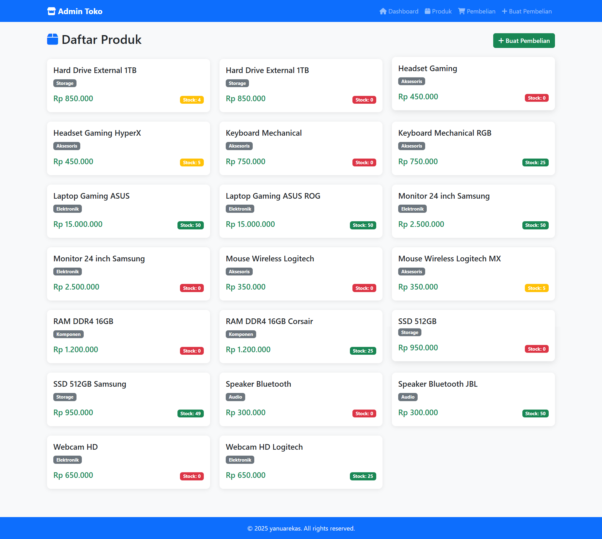
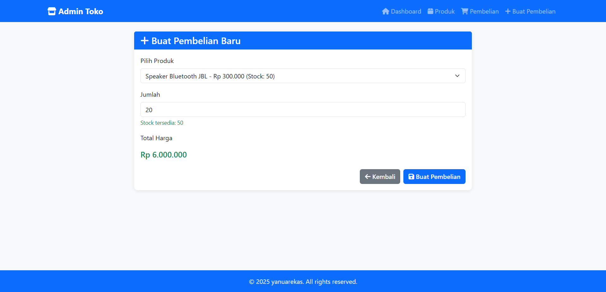
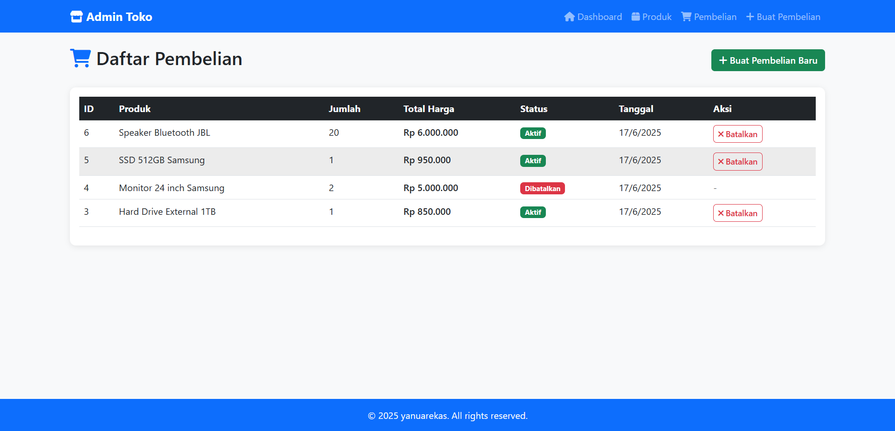

## 🛠️ Installation

### 1. Clone the repo

```bash
git clone https://github.com/xsohe/test-toko.git
```

### 2. Change to directory test-toko

```bash
cd test-toko
```

### 3. Install dependencies

```bash
npm install
```

### 4. Seed Database

```bash
npm run seed
```

### 5. Run The APP

```bash
npm run start
```

## 👁️ Preview APP

### Preview Admin Pages

- Dashboard Page
  
  This application displays a visual dashboard summarizing product inventory information, including:

  - Total Products: the overall number of products in the database
  - Available Products: products that are currently in stock
  - Low Stock Products: products with stock below a predefined threshold (e.g., ≤ 5 units)
  - Out of Stock Products: products with zero stock

  Additionally, the dashboard highlights the most recently added product, providing an at-a-glance view of the latest inventory updates.

- All Products Page
  
  All Products Page: This page lists all products in the system, regardless of their stock status, whether available, low stock, or out of stock.

- Purchase Page
  
  Purchase Page: This page enables users to make purchase transactions by selecting a product, specifying the quantity to purchase, and automatically calculating the total price based on the selected product and quantity.

- Lists Purchase Page
  
  Lists Purchase Page: This page shows a list of all recorded purchases. Each purchase is marked as Active by default, with an available action to cancel the purchase when necessary.
